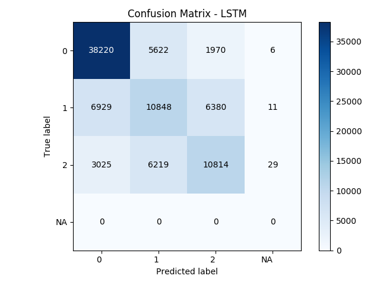
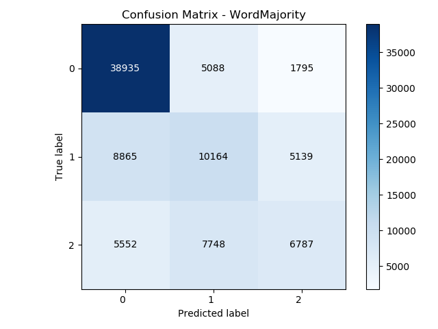

# BERT-prosody
Prosody prediction using BERT

## Usage

To use the system following dependencies need to be installed:

* Python 3
* torch>=1.0
* argparse
* pytorch_pretrained_bert
* numpy
* matplotlib
* sklearn


To install the requirements run:

```console
pip3 install -r requirements.txt
```

To download the word embeddings for the LSTM model run:
```console
./download_embeddings.sh
```

For the **BERT** model run training by executing:

```console
# Train BERT-Uncased
python3 main.py \
    --model BertUncased \
    --train_set train_360 \
    --batch_size 32 \
    --epochs 2 \
    --save_path results.txt \
    --log_every 50 \
    --learning_rate 0.00005 \
    --weight_decay 0 \
    --gpu 0 \
    --fraction_of_sentences 1 \
    --optimizer adam \
    --seed 1234
```

For the **LSTM** model run training by executing:
```console
# Train 3-layer BiLSTM
python3 main.py \
    --model BiLSTM \
    --train_set train_360 \
    --layers 3 \
    --hidden_dim 600 \
    --batch_size 64 \
    --epochs 5 \
    --save_path results.txt \
    --log_every 50 \
    --learning_rate 0.001 \
    --weight_decay 0 \
    --gpu 0 \
    --fraction_of_sentences 1 \
    --optimizer adam \
    --seed 1234
```


## Output

Output of the system is a text file with the following structure:

```
<word> tab <label> tab <prediction>
```

Example output:
```
And 0 0
those 2 2
who 0 0
meet 1 2
in 0 0
the 0 0
great 1 1
hall 1 1
with 0 0
the 0 0
white 2 1
Atlas 2 2
? NA NA
```

## Models

* [BERT](https://arxiv.org/abs/1810.04805)-base Uncased
* [BERT](https://arxiv.org/abs/1810.04805)-base Cased
* [Minitagger](https://github.com/karlstratos/minitagger) A multi-class SVM trained using GloVe word embeddings. Paper: https://www.aclweb.org/anthology/W15-1511
* 1-layer 600D LSTM
* 3-layer 600D Bidirectional LSTM

## Results

**Results (excluding NA tag - test_360)**

| Model                                           |  Train data | accuracy    |precision   |  recall     | f1-score   |
| ---                                             | ---         | ---         | ---        | ---         | ---        |
| BERT-base uncased                               | train-360   | **0.6955**  |  0.6877    |  0.6877     | 0.6909     |
| BERT-base cased                                 | train-360   |  0.6947     | **0.6936** |  0.6947     | **0.6937** |
| BERT-base uncased + 3-layer BiLSTM              | train-360   |  0.6954     |  0.6932    | **0.6954**  | 0.6919     |
| BiLSTM (3 layers)                               | train-360   |  0.6771     |  0.6690    |  0.6771     | 0.6714     |
| LSTM (1 layers)                                 | train-360   |  0.6587     |  0.6487    |  0.6587     | 0.6506     |
| Majority per word                               | train-360   |  0.6055     |  0.4897    |  0.6055     | 0.5394     |
| Minitagger (SVM) + word embeddings (GloVe)      | train-360   |  0.6645     |  0.6493    |  0.6645     | 0.6535     |
| Minitagger (SVM) + word embeddings (Speech2Vec) | train-360   |  0.6647     |  0.6489    |  0.6647     | 0.6534     |
| Minitagger (SVM)                                | train-360   |  0.6548     |  0.6384    |  0.6548     | 0.6435     |


**Results (excluding NA tag - test_100)**

| Model                                           |  Train data | accuracy    |precision   |  recall     | f1-score   |
| ---                                             | ---         | ---         | ---        | ---         | ---        |
| BERT-base uncased                               | train-100   | **0.6849**  | **0.6813** | **0.6849**  | **0.6824** |
| BERT-base cased                                 | train-100   |  0.6849     |  0.6712    |  0.6849     | 0.6756     |
| BERT uncases + all layers                       | train-100   |  0.6709     |  0.6623    |  0.6709     | 0.6659     |
| BERT uncased + class encodings                  | train-100   |  0.6667     |  0.6697    |  0.6667     | 0.6681     |
| BiLSTM (3 layers)                               | train-100   |  0.6648     |  0.6577    |  0.6648     | 0.6608     |
| LSTM (1 layers)                                 | train-100   |  0.6460     |  0.6380    |  0.6460     | 0.6414     |
| Minitagger (SVM) + word embeddings              | train-100   |  0.6455     |  0.6402    |  0.6455     | 0.6426     |
| Majority per word                               | train-100   |  0.6210     |  0.5995    |  0.6210     | 0.6057     |
| Majority class                                  |             |  0.5087     |  0.2588    |  0.5087     | 0.3430     |


## Analysis

Sample analyses (to be reproduced for the paper)






## TODO

* BERT (DONE)
* Words embeddings + LSTM (DONE)
* BERT + LSTM (DONE)
* Regression (Need to debug for time and run on new data)
* Majority for each word (DONE)
* Class-encodings for ordinal class labels (Running on taito)
* Context model (neighbours) (Hande)
* CRF (Hande)
* BERT + position encoding
* Other pre-trained models (GPT, ELMo etc)
* Sort sentences before forming batches? (Hande, least priority)
* Using all layers of BERT for representation (Running on taito)
